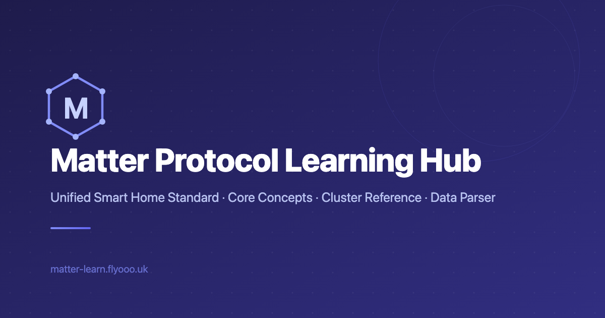

<div align="center">

**English** · [简体中文](README.zh-CN.md)


# Matter Learn

**An open-source, bilingual learning site for the Matter smart home protocol**

Illustrated concepts · 82 standard Cluster references · Device data parser · SDK guides

[](https://github.com/CherryLover/matter-learn/actions/workflows/ci.yml) [](https://astro.build) [](https://nodejs.org) [](#internationalization) [](LICENSE) [](LICENSE-CONTENT)

[Live site](https://matter-learn.flyooo.uk/en/) · [中文站点](https://matter-learn.flyooo.uk/zh/) · [Report an issue](https://github.com/CherryLover/matter-learn/issues)



</div>

---

## About

[Matter](https://csa-iot.org/all-solutions/matter/) is the unified smart home standard led by the Connectivity Standards Alliance (CSA). It comes with a lot of concepts (Node, Endpoint, Cluster, Attribute, Command…) and a long, dense specification, which makes onboarding hard for app, firmware, QA, product, and design folks alike.

Matter Learn organizes that knowledge into **plain explanations, diagrams, and real device data**, so anyone on the team can understand the model quickly and look things up when they need them.

## Features

| Section | What's inside |
| --- | --- |
| 📘 **Concepts** | The Node → Endpoint → Cluster → Attribute / Command data model explained with a "smart building" analogy, plus diagrams for the protocol stack, commissioning, fabrics, device types, and interoperability |
| 📚 **Cluster Reference** | **82 standard Clusters** in 12 spec categories — attributes, commands, feature maps, enums, annotated real-device JSON, and dev tips |
| 🛠️ **JSON Parser** | Paste raw device JSON and get a readable Endpoint / Cluster / Attribute breakdown |
| 🔎 **ID Lookup** | Look up a Cluster ID, device type ID, or global attribute ID (hex / decimal / name) and see how the 32-bit ID is structured |
| 📱 **SDK Guides** | How to integrate Matter on Android, iOS, and the Web, with a side-by-side comparison |
| 🗺️ **Roadmap** | What each Matter release added in device types and capabilities |
| 🌐 **Resources** | Curated links to official docs, platform programs, chip SDKs, open-source projects, and certification tools |

Also included: Chinese / English, dark mode, in-page table of contents, and full SEO setup (sitemap, structured data, hreflang, social preview images).

## Getting Started

### Prerequisites

- Node.js **>= 22.12.0**
- npm

### Run locally

```bash
git clone https://github.com/CherryLover/matter-learn.git
cd matter-learn
npm install
npm run dev
```

Open <http://localhost:4321>. The root path redirects to `/zh/` or `/en/` based on your browser language.

### Scripts

| Command | Description |
| --- | --- |
| `npm run dev` | Start the dev server at `localhost:4321` |
| `npm run build` | Build the static site into `dist/` |
| `npm run preview` | Preview the production build locally |

## Tech Stack

- **[Astro 7](https://astro.build)** — static site generation; every page is prerendered to HTML
- **[React 19](https://react.dev)** — only for interactive tools such as the JSON parser and ID lookup (hydrated on demand)
- **[Tailwind CSS 4](https://tailwindcss.com)** — styling
- **[Lucide](https://lucide.dev)** — icons
- **@astrojs/sitemap** — sitemap generation

## Project Structure

```text
matter-learn/
├── public/                     # Static assets: favicon, social image, diagrams
│   └── images/diagrams/        # Concept diagrams (each in -zh and -en versions)
├── scripts/
│   └── gen-matter-spec.py      # Generates the Matter ID table from official ZAP XML
├── src/
│   ├── components/             # Header, Footer, TOC, interactive tools
│   ├── data/                   # Matter definitions, ID table, sample device data
│   ├── i18n/
│   │   ├── config.ts           # Locale config and path helpers
│   │   ├── ui.ts               # Shared UI strings
│   │   ├── cluster-loader.ts   # Merges all Cluster content
│   │   ├── zh/                 # Chinese content
│   │   │   ├── clusters/       # Cluster details by category (lighting.ts, hvac.ts, …)
│   │   │   └── pages/          # Page copy
│   │   └── en/                 # English content (mirrors zh/)
│   ├── layouts/                # BaseLayout (SEO / theme), DocLayout (docs pages)
│   ├── pages/
│   │   ├── index.astro         # Root path, redirects by browser language
│   │   └── [lang]/             # Every page is generated per locale: /zh/…, /en/…
│   └── styles/                 # Global styles
└── astro.config.mjs
```

## Internationalization

Chinese is the default locale, and every page has a locale prefix:

- Chinese: `/zh/...`
- English: `/en/...`

Content lives in `src/i18n/zh/` and `src/i18n/en/` with matching file structure and object keys. When you add or change content, **please update both languages**.

## Contributing

Contributions of any kind are welcome: fixing mistakes, filling in Cluster details, improving translations, or adding diagrams and tools.

### Adding or editing a Cluster

1. Add or edit the entry in `src/i18n/zh/clusters/<category>.ts`. The key becomes the URL slug (e.g. `'on-off'` → `/zh/clusters/on-off/`).
2. Mirror the change in `src/i18n/en/clusters/<category>.ts`.
3. Add a card under the matching category in `src/i18n/zh/pages/cluster-index.ts` and `src/i18n/en/pages/cluster-index.ts`.
4. Check the neighbouring entries' `prev` / `next` so page navigation stays continuous.

### Updating the Matter ID table

The ID lookup data is generated from the official [connectedhomeip](https://github.com/project-chip/connectedhomeip) ZAP XML files. See the header of `scripts/gen-matter-spec.py` for instructions.

### Workflow

1. Fork the repo and create a branch
2. Run `npm run build` and make sure it passes with no new broken links
3. Open a pull request describing what changed and which spec or source it's based on

By submitting a contribution, you agree that it is licensed under this project's licenses (MIT for code, CC BY-NC-SA 4.0 for content), and you additionally grant the maintainer the right to use, modify, and distribute your contribution for any purpose, including commercial use on the official site.

Spotted a mistake but can't fix it yourself? [Opening an issue](https://github.com/CherryLover/matter-learn/issues) helps a lot too.

## Deployment

The output is a plain static site, so any static host works:

- **Cloudflare Pages** — connect the GitHub repo, build command `npm run build`, output directory `dist`
- **Nginx / any static server** — run `npm run build` and serve `dist/`

GitHub Actions builds every push to `main` and publishes a zipped copy of the site to [Releases](https://github.com/CherryLover/matter-learn/releases), ready to deploy.

## Disclaimer

Content is compiled from the public Matter specification, official SDK sources, and hands-on device debugging, and is intended for learning. If anything conflicts with the official CSA specification, the specification wins. Matter is a trademark of the Connectivity Standards Alliance; this project is not affiliated with the CSA.

## License

This project uses two licenses:

- **Code** — [MIT](LICENSE). Everything that isn't listed below.
- **Written content and diagrams** — [CC BY-NC-SA 4.0](LICENSE-CONTENT). This covers `src/i18n/zh/`, `src/i18n/en/`, and `public/images/`. You may share and adapt it with attribution, for non-commercial purposes, under the same license.

`src/data/matter-spec.json` is generated from [connectedhomeip](https://github.com/project-chip/connectedhomeip) (Apache License 2.0).
