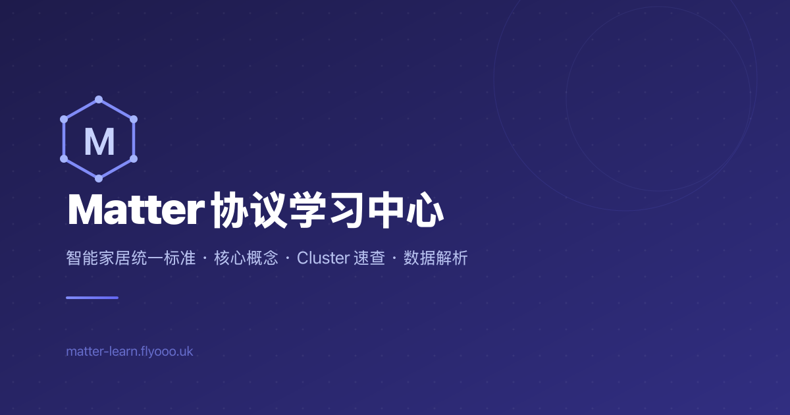

<div align="center">

[English](README.md) · **简体中文**


# Matter Learn

**用中文把 Matter 智能家居协议讲清楚的开源学习站**

概念图解 · 82 个标准 Cluster 手册 · 设备数据解析 · SDK 指南

[](https://github.com/CherryLover/matter-learn/actions/workflows/ci.yml) [](https://astro.build) [](https://nodejs.org) [](#多语言) [](LICENSE) [](LICENSE-CONTENT)

[在线访问](https://matter-learn.flyooo.uk/zh/) · [English Site](https://matter-learn.flyooo.uk/en/) · [反馈问题](https://github.com/CherryLover/matter-learn/issues)



</div>

---

## 简介

[Matter](https://csa-iot.org/all-solutions/matter/) 是由 CSA 连接标准联盟主导的智能家居统一标准。它的概念很多（Node、Endpoint、Cluster、Attribute、Command……），官方规范又厚又全是英文，团队里做 App、固件、测试、产品、设计的同学上手成本都不低。

Matter Learn 想解决的就是这个问题：**用中文、配图解、结合真实设备数据**，把 Matter 的知识体系系统梳理一遍，让每个角色都能快速看懂、随手查到。

## 功能

| 板块 | 内容 |
| --- | --- |
| 📘 **概念总览** | 用「智能大楼」类比讲清 Node → Endpoint → Cluster → Attribute / Command 四层数据模型，配套协议栈、配网、Fabric、设备类型、互操作等示意图 |
| 📚 **Cluster 手册** | 按 Matter 规范分 12 大类收录 **82 个标准 Cluster**，每个都有属性、命令、Feature 位图、枚举值、真实设备 JSON 示例与开发提示 |
| 🛠️ **JSON 解析工具** | 贴入设备原始 JSON，自动还原成人类可读的 Endpoint / Cluster / 属性结构 |
| 🔎 **ID 查询工具** | 输入 Cluster ID、设备类型 ID 或全局属性 ID（十六进制 / 十进制 / 名称），立即查出含义并拆解 32 位 ID 结构 |
| 📱 **SDK 指南** | Android、iOS、Web 三个平台接入 Matter 的方式与对比 |
| 🗺️ **版本路线图** | Matter 各版本新增的设备类型与能力 |
| 🌐 **生态资源** | 官方文档、商业平台、芯片 SDK、开源项目、认证工具等一站式汇总 |

此外还有：中英双语、深色模式、页内目录、完整的 SEO 基础设施（站点地图、结构化数据、多语言 hreflang、社交分享预览图）。

## 快速开始

### 环境要求

- Node.js **>= 22.12.0**
- npm

### 本地运行

```bash
git clone https://github.com/CherryLover/matter-learn.git
cd matter-learn
npm install
npm run dev
```

打开 <http://localhost:4321> 即可预览。根路径会按浏览器语言自动跳转到 `/zh/` 或 `/en/`。

### 常用命令

| 命令 | 作用 |
| --- | --- |
| `npm run dev` | 启动本地开发服务器（`localhost:4321`） |
| `npm run build` | 构建静态站点到 `dist/` |
| `npm run preview` | 本地预览构建产物 |

## 技术栈

- **[Astro 7](https://astro.build)** — 静态站点生成，全站预渲染为纯 HTML
- **[React 19](https://react.dev)** — 仅用于 JSON 解析、ID 查询等交互组件（按需水合）
- **[Tailwind CSS 4](https://tailwindcss.com)** — 样式
- **[Lucide](https://lucide.dev)** — 图标
- **@astrojs/sitemap** — 自动生成站点地图

## 项目结构

```text
matter-learn/
├── public/                     # 静态资源：favicon、分享图、概念示意图
│   └── images/diagrams/        # 概念图（每张都有 -zh / -en 两个版本）
├── scripts/
│   └── gen-matter-spec.py      # 从官方 ZAP XML 生成 Matter ID 数据表
├── src/
│   ├── components/             # Header、Footer、目录、交互工具组件
│   ├── data/                   # Matter 定义、ID 数据表、示例设备数据
│   ├── i18n/
│   │   ├── config.ts           # 语言配置与路径工具函数
│   │   ├── ui.ts               # 界面通用文案
│   │   ├── cluster-loader.ts   # 汇总所有 Cluster 内容
│   │   ├── zh/                 # 中文内容
│   │   │   ├── clusters/       # 按分类存放的 Cluster 详情（lighting.ts、hvac.ts…）
│   │   │   └── pages/          # 各页面文案
│   │   └── en/                 # 英文内容（结构与 zh/ 一致）
│   ├── layouts/                # BaseLayout（SEO / 主题）、DocLayout（文档页）
│   ├── pages/
│   │   ├── index.astro         # 根路径，按浏览器语言跳转
│   │   └── [lang]/             # 所有页面都按语言前缀生成：/zh/…、/en/…
│   └── styles/                 # 全局样式
└── astro.config.mjs
```

## 多语言

站点默认语言为中文，所有页面都带语言前缀：

- 中文：`/zh/...`
- English：`/en/...`

中英文内容分别放在 `src/i18n/zh/` 和 `src/i18n/en/`，两边的文件结构和对象键名保持一一对应。修改或新增内容时，请**同时更新两种语言**。

## 参与贡献

欢迎任何形式的贡献：纠正错误、补充 Cluster 细节、改进翻译、新增示意图或工具。

### 新增或修改一个 Cluster

1. 在 `src/i18n/zh/clusters/<分类>.ts` 中新增或修改条目，键名就是页面路径（例如 `'on-off'` → `/zh/clusters/on-off/`）。
2. 在 `src/i18n/en/clusters/<分类>.ts` 中同步英文版本。
3. 在 `src/i18n/zh/pages/cluster-index.ts` 和 `src/i18n/en/pages/cluster-index.ts` 的对应分类下加入卡片。
4. 检查相邻条目的 `prev` / `next`，保证上一篇 / 下一篇导航连贯。

### 更新 Matter ID 数据表

ID 查询工具使用的数据来自 [connectedhomeip](https://github.com/project-chip/connectedhomeip) 官方 ZAP XML，更新方法见 `scripts/gen-matter-spec.py` 顶部说明。

### 提交流程

1. Fork 本仓库并新建分支
2. 修改后运行 `npm run build`，确保构建通过、没有新增断链
3. 提交 Pull Request，说明改了什么、依据是哪份规范或资料

提交贡献即表示你同意：你的贡献按本项目的许可证发布（代码 MIT，内容 CC BY-NC-SA 4.0），同时授权维护者可以将其用于任何用途，包括在官方站点上的商业用途。

发现内容错误但不方便改？直接[提一个 Issue](https://github.com/CherryLover/matter-learn/issues) 也非常有帮助。

## 部署

站点是纯静态产物，任何静态托管都可以部署：

- **Cloudflare Pages**：连接 GitHub 仓库，构建命令 `npm run build`，输出目录 `dist`
- **Nginx / 任意静态服务器**：`npm run build` 后托管 `dist/` 目录

仓库配置了 GitHub Actions：每次推送到 `main` 都会自动构建，并把站点打包成 zip 发布到 [Releases](https://github.com/CherryLover/matter-learn/releases)，可以直接下载部署。

## 免责声明

本站内容基于 Matter 公开规范、官方 SDK 源码与实际设备调试经验整理，仅供学习参考。如与 CSA 官方规范存在出入，请以官方规范为准。Matter 是 Connectivity Standards Alliance 的商标，本项目与 CSA 无隶属关系。

## 许可证

本项目采用双许可证：

- **代码**：[MIT](LICENSE)，适用于下面列出范围以外的所有文件。
- **文字内容与示意图**：[CC BY-NC-SA 4.0](LICENSE-CONTENT)，适用于 `src/i18n/zh/`、`src/i18n/en/` 和 `public/images/`。可以转载和改编，但需署名、不得用于商业用途，且改编作品须以相同许可证发布。

`src/data/matter-spec.json` 由 [connectedhomeip](https://github.com/project-chip/connectedhomeip) 生成，遵循 Apache License 2.0。
